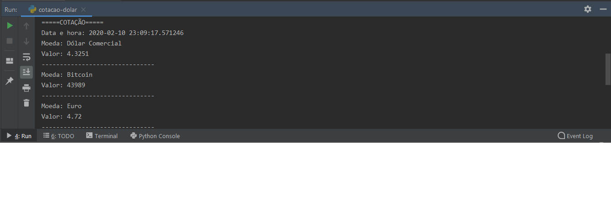
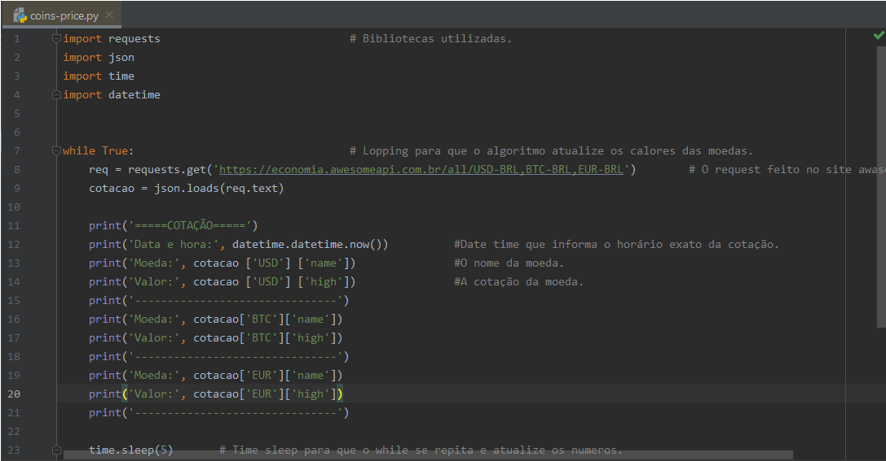

# Coins-Price-Python-API
Coins-Price (Cotação de moedas) é um projeto de aplicação de Bibliotecas e API em Python





## Sobre
Coins-Price (Cotação de moedas) foi um projeto / treino de aprendizado onde tive a experiência de utilizar e aprender novas técnicas em python como:
<ul>
    <li>Instalar bibliotecas/API por terminal (<i>pip install ----<i>)</li>
    <li>Importar bibliotecas.</li>
    <li>Utilizar algumas bibliotecas (<i>Requests, Time, Datetime, Json </i>)</li>
    <li>Utilizar algumas coisas em JSON</li>
    <li>Utilizar o While para novas maneiras.</li>
</ul>

## O desenvolvimento 

O desenvolvimento da aplicação da API com o professor <b>Guilherme Junqueira</b> foi bem interessante.

Vou listar o passo a passo dos pontos que achei mais interessante e importante.

#### 1- Instalando bibliotecas
<ul>
    <li>Nesse primeiro passo aprendi sobre a biblioteca requests e suas funcionalidades/importancia.</li>
    <li>Aprendi comandos como o .get para fazer requisições e entre outros</li>
    <li>Instalei via terminal o pacote requests atraves do:</li>
</ul>

```
pip install requests
```
#### 2- Requisitando a API
<ul>
    <li>Tive a tarefa de procurar uma API de cotação em tempo real de forma gratuita, e acabei encontrando  a [AwesomeAPI](https://docs.awesomeapi.com.br) que forneceu de forma gratuita a API.</li>
    <li>Utilizei a ferramenta get e fiz a requisição para a AwesomeAPI como o exemplo abaixo:</li>

```
eq = requests.get('https://economia.awesomeapi.com.br/all/USD-BRL,BTC-BRL,EUR-BRL')
```

#### 3- Utilizando o JSON
<ul>
    <li>Depois de tanto ouvir falar do famoso JSON, finalmente tive a oportunidade de utilizá-lo.</li>
    <li>Depois de  importá-lo, criei uma variável chamada <i>cotacao</i> e lá com o comando <i>.jsonloads()<i> do JSON consegui printar de forma certa a API.</li>
</ul>

```
cotacao = json.loads(req.text)
```


#### 4- Utilizando o DateTime e o Time
<ul>
    <li>Com a ajuda do professor <b>Guilherme Junqueira</b> utilizei a ferramenta do DateTime e time.</li>
    <li>Consegui colocar a data e a hora no qual foi impresso na tela os valores das moedas, como no exemplo abaixo:</li>
</ul>

```
print('Data e hora:', datetime.datetime.now()) 
```

#### Printando valores 
<ul>
  <li>O próximo passo era printar na tela os valores das moedas.</li>
</ul>

Dolar:
```
print('Moeda:', cotacao ['USD'] ['name'])               #O nome da moeda.
```

```
print('Valor:', cotacao ['USD'] ['high'])               #A cotação da moeda.
```
BitCoin
```
print('Moeda:', cotacao['BTC']['name'])                 #O nome da moeda.
```
    
```
print('Valor:', cotacao['BTC']['high'])                 #A cotação da moeda.
```
 Euro
 
```  
print('Moeda:', cotacao['EUR']['name'])                 #O nome da moeda.
``` 

```
print('Valor:', cotacao['EUR']['high'])                 #A cotação da moeda.
```

#### Utilizando o While e o TimeSlepp
<ul>
    <li>Utilizei o While como uma forma de atualizar constantemente os valores, para isso utilizei :</li>
</ul>

```
while True:                                 # Lopping para que o algoritmo atualize os calores das moedas.
```

<ul>
   <li>E logo ao final do while utilizei o TimeSlepp para que o retorno e o print da tela fosse de forma controlada e mais devagar.</li>
</ul>

```
 time.sleep(5)       # Time sleep para que o while se repita e atualize os números.
```

## Redes sociais

* [Linkedin](https://www.linkedin.com/in/adilson-júnior-5b0934187) 
* [Codepen](https://codepen.io/adilson-j-nior) 
* [GitHUb](https://github.com/1Adilson) 

## Contribuição
Todo esse projeto e aprendizado se deve a solyd e ao professor <b>Guilherme Junqueira</b> por de forma gratuita ensinar e disponibilizar ótimos conteúdos 

Contato do <b>Guilherme Junqueira</b> [Linkedin](https://www.linkedin.com/in/guilhermej) 

Contato da plataforma [Solyd](https://solyd.com.br/ead/) 

## Finalização
Este projeto foi de total cunho educativo onde passei a minha visão de colocar em prática meus aprendizados em Python

      
